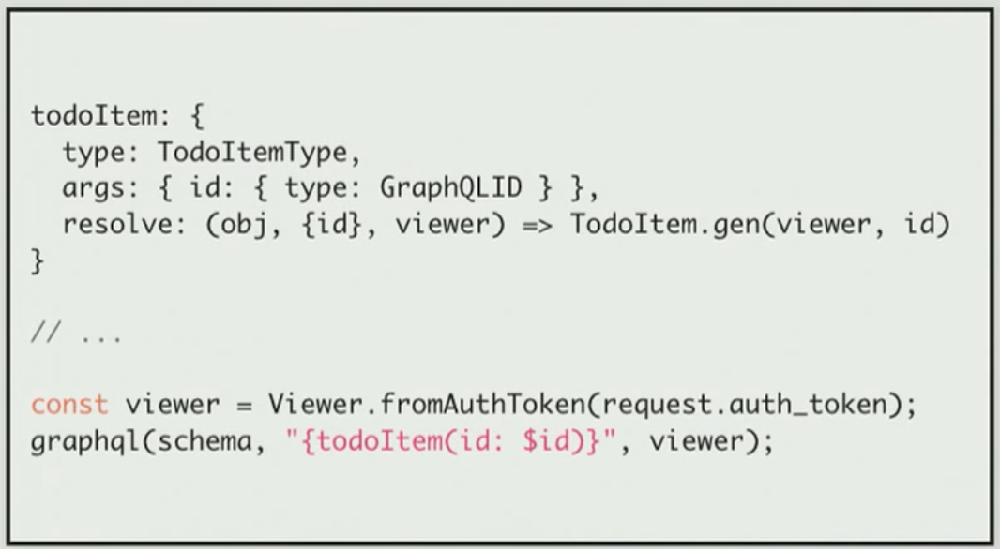
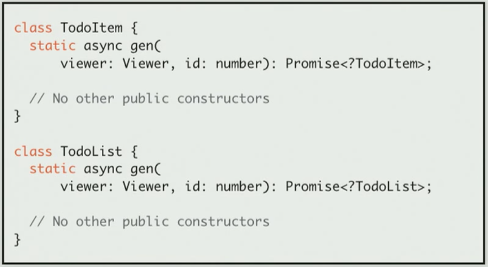
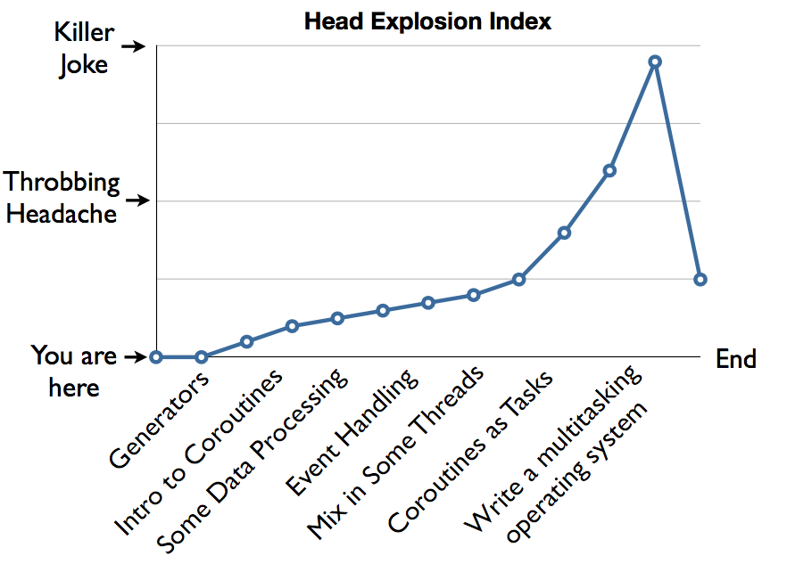
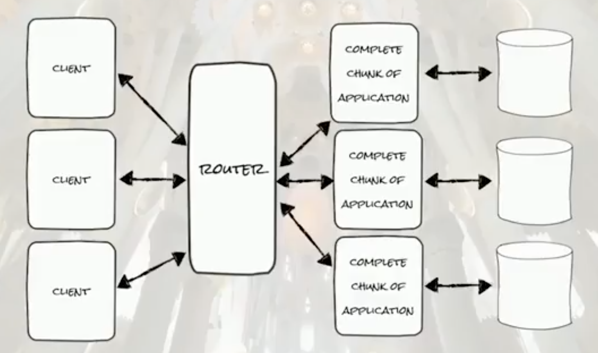
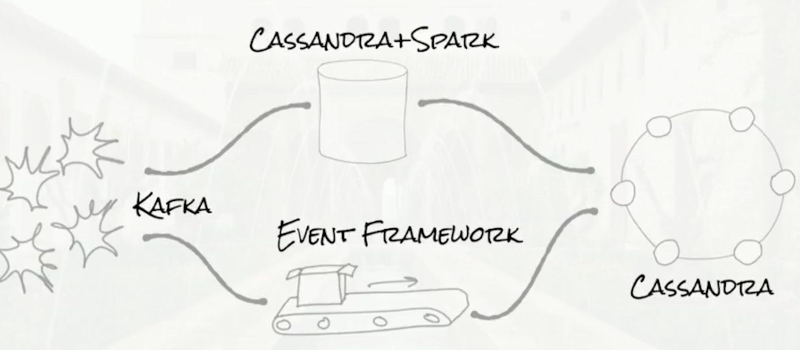
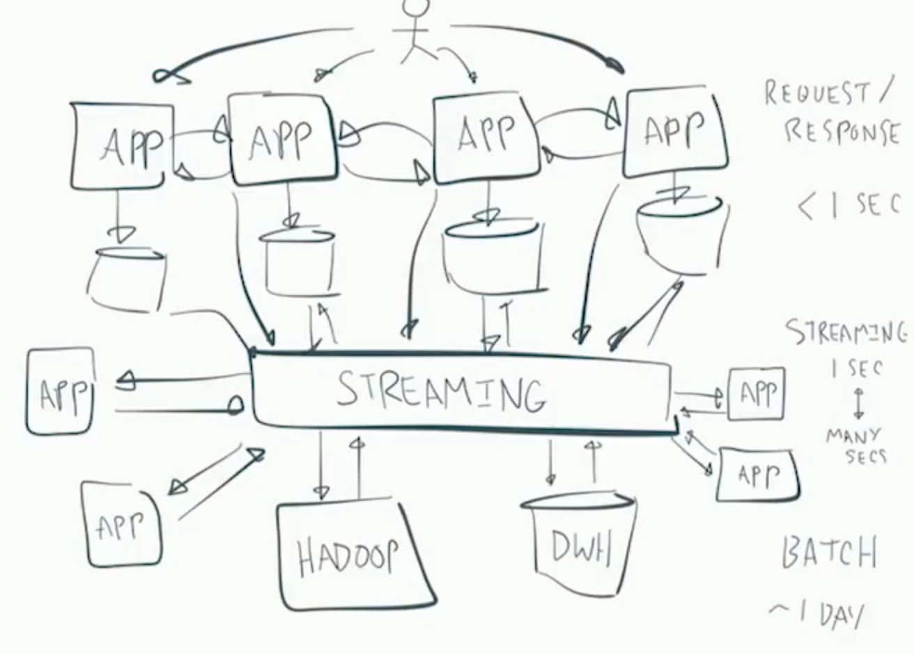
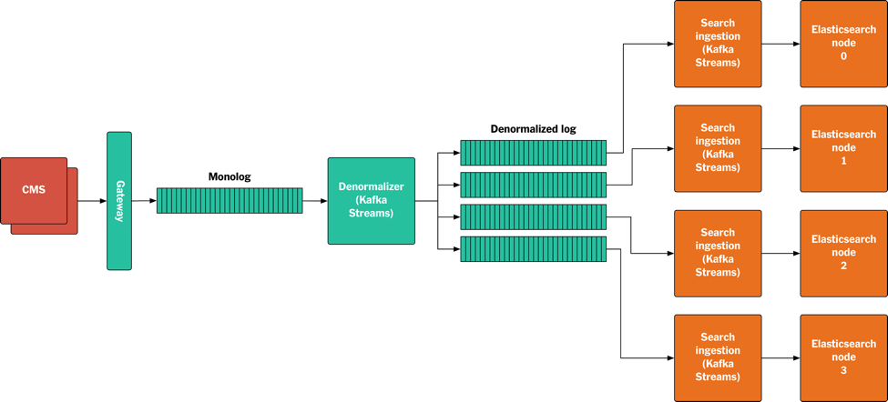
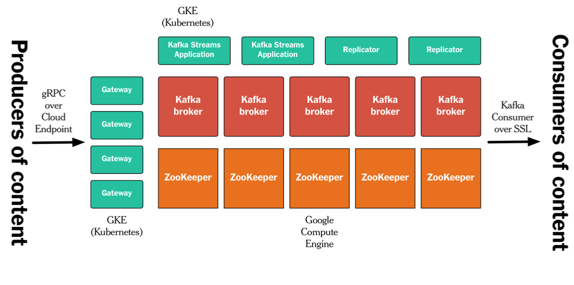

# reading-notes

Reading notes for books, articles, videos and etc.

## GraphQL

https://www.youtube.com/watch?v=etax3aEe2dA[Dan Schafer - GraphQL at Facebook at react-europe 2016]

*Core Principles*: think graph, not endpoints; single source of truth; thin api layer

*Authorization Implementation*:

*Cache*: Globally Unique Cache Key; Refetch Identifier; Opaque to Clients

## React

https://www.robinwieruch.de/learn-react-before-using-redux/?utm_campaign=React%2BNewsletter&utm_medium=email&utm_source=React_Newsletter_80[8 things to learn in React before using Redux]

`props` flow down the component tree, `state` is managed by a component alone and `functions` can bubble up to alter the state in a component that manages state. The updated state can be passed down as props again.

In your top level component(React root component), you would declare the state container in the `React context`(https://www.robinwieruch.de/react-provider-pattern-context/[How to use React's Provider Pattern]) so that it is implicitly accessible for each component down the component tree.

## Python

http://www.dabeaz.com/coroutines/Coroutines.pdf[A Curious Course on Coroutines and Concurrency]

* Most of the groundwork for coroutines occurred in the 60s/70s and then stopped in favor of alternatives (e.g., threads, continuations).

* *Generators vs. Coroutines*: Generators pull data through the pipe with iteration, Coroutines push data into the pipeline with send().

* Coroutines are somewhat similar to OO design patterns involving simple `handler` objects. Coroutines can be used to write various components that process event streams.

* One send data to coroutines directly, or one send data to threads via `queues`, or one send data to processes via `messages`. You can package coroutines inside threads or subprocesses by adding extra layers.

* With coroutines, you can separate the implementation of a task from its execution environment. The coroutine is the implementation, and the environment is whatever you choose (threads, subprocesses, network, etc.).

* Coroutines are `tasks`, but they're not tied to threads or subprocesses.

## Distributed System

https://www.youtube.com/watch?v=tpspO9K28PM&list=WL&index=17[Four Distributed Systems Architectural Patterns by Tim Berglund]

* Modern Three-Tier(Presentation Tier, Business Tier, Data Tier)

Weakness: state in the middle tier

image::assets/modern_three_tier.png[]

* Sharded

Strengths: Client isolation is easy(data and deployment); Known, simple technologies

Weaknesses: complexity; no comprehensive view of data(ETL); oversized shards

* Lambda Architecture

Strengths: optimizes subsystems based on operational requirements; good at unbounded data

Weaknesses: complex to operate and maintain; no, seriously(need write same code twice)

* Streaming

https://www.confluent.io/blog/publishing-apache-kafka-new-york-times/[Publishing with Apache Kafka at The New York Times]

* API-based architecture issues: inconsistent schema; difficult to stream content archives

* Log-based architecture:
** databases is difficult to manage in the long run: tricky to change the schema; hard to replace; being complex monoliths.
** Log-based architecture makes the log the source of truth.
** Every system can create its own data store (database) – its own materialized view – representing only the data it needs, in the form that is the most useful for that system.
** Simplifies accessing streams of content.
** By always redeploying a new instance from scratch instead of modifying a running one, a whole category of problems go away.

* why Kafka not Amazon SQS/SNS and Google Pubsub: only Kafka supports retain all events forever and log consumption to be ordered.

* The Monolog is new source of truth for published content. Every system that creates content, when it’s ready to be published, will write it to the Monolog, where it is appended to the end.
* In the denormalized log, all the components making up a top-level asset are published together.
* Since this log is denormalized, it no longer needs total ordering.

